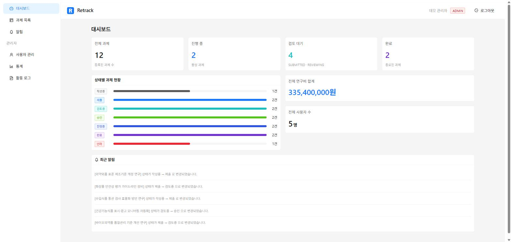
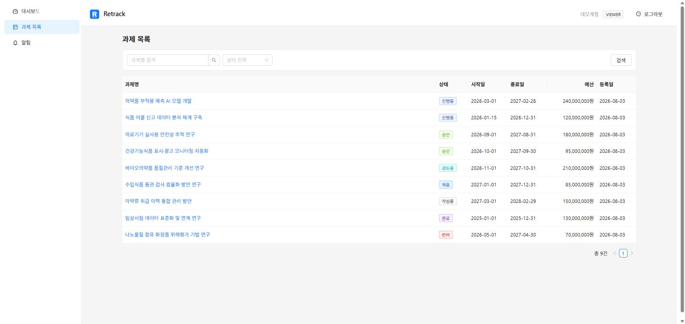
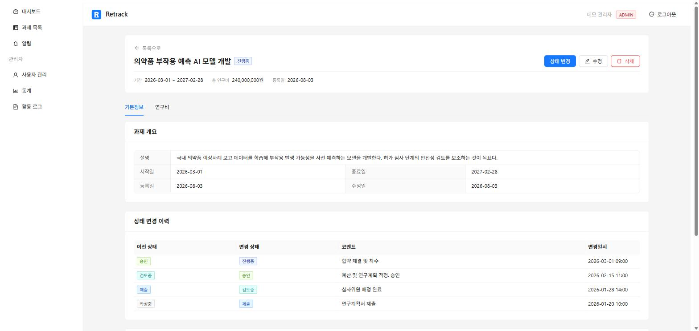
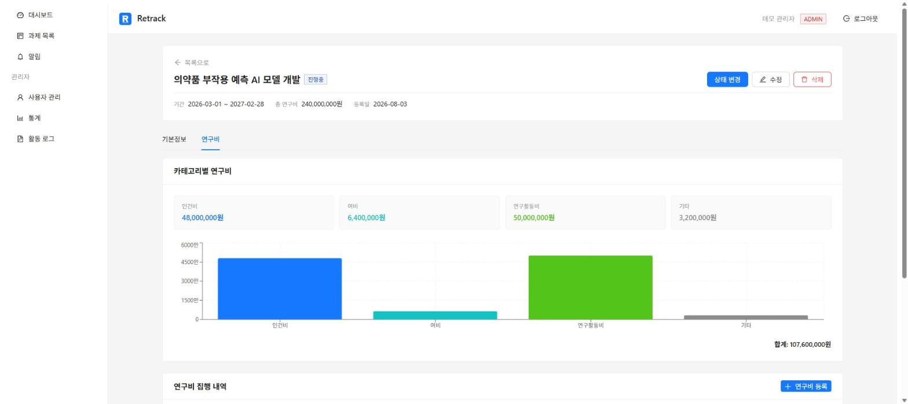

# Retrack — 연구과제 관리 시스템

연구과제의 등록부터 상태 관리, 연구비 집계, 파일 첨부, 이메일 알림까지 처리하는 웹 기반 관리 시스템입니다.

**운영 중** → **https://hughpark.com**

식약처 디스패치 근무 당시 연구과제 관리 업무를 접하며 겪은 불편을 바탕으로 기획했습니다.
엑셀과 메일로 흩어져 관리되던 과제 진행 상황·연구비 집행 내역을 한 곳에서 추적하고,
상태 변경 시 담당자에게 자동으로 알림이 가도록 만드는 것이 목표였습니다.

### 데모 계정

가입 없이 바로 둘러보실 수 있습니다. 랜딩 페이지의 **체험하기** 버튼을 누르면 자동으로 로그인됩니다.

```
아이디   demo@hughpark.com
비밀번호  demo1234!
```

관리자 권한이라 통계·사용자 관리·활동 로그까지 확인할 수 있습니다.
입력한 데이터는 매일 새벽 초기화됩니다.

---

## 화면

| 대시보드 | 과제 목록 |
|---|---|
|  |  |
| 역할별로 다른 지표를 보여줍니다. 상태별 과제 현황과 최근 알림을 함께 표시합니다. | 과제명 검색과 상태 필터, 페이지네이션을 지원합니다. |

| 과제 상세 — 기본정보 | 과제 상세 — 연구비 |
|---|---|
|  |  |
| 과제 정보와 상태 변경 이력을 시간순으로 추적합니다. | 카테고리별 집계와 집행 내역을 관리합니다. |

---

## 기술 스택

| 구분 | 기술 |
|---|---|
| Backend | Java 11, Spring Framework 5.3, MyBatis 3.5, Tomcat 9 |
| Frontend | React 18, Vite, Zustand, axios, Ant Design 5 |
| Database | PostgreSQL 14 |
| Infra | AWS EC2 (Ubuntu 24.04), Docker Compose, Nginx, Let's Encrypt |
| Test | JUnit 5, Mockito |

### Spring Boot를 쓰지 않은 이유

공공기관과 SI 현장에는 여전히 Spring Framework + XML 설정 + WAR 배포 구조가 많습니다.
Boot의 자동 설정에 기대지 않고 `web.xml`, `spring-mvc.xml`, `spring-db.xml`을 직접 다루면서
DispatcherServlet 등록, 인터셉터 체인, 트랜잭션 매니저 설정을 직접 구성했습니다.

---

## 주요 기능

- **인증/인가** — JWT 기반 인증, `@RequiredRole` 어노테이션으로 메서드 단위 권한 제어
- **권한 계층** — VIEWER < RESEARCHER < MANAGER < ADMIN 4단계
- **과제 관리** — 등록/수정/삭제, 상태 전이 규칙 검증, 변경 이력 추적
- **연구비 관리** — 카테고리별 집행 내역 등록 및 집계, 번레이트 산출
- **파일 관리** — 확장자 화이트리스트 검증, UUID 저장명, 업로드 실패 시 롤백
- **알림** — 상태 변경 시 이메일 자동 발송 (Gmail SMTP)
- **활동 로그** — AOP로 모든 주요 동작 자동 기록
- **통계/대시보드** — 역할별로 다른 대시보드, 상태별·카테고리별 집계 차트

---

## 설계에서 신경 쓴 부분

### 파일 저장소 교체 가능 구조

로컬 디스크 저장을 나중에 S3로 바꿀 수 있도록 Strategy 패턴으로 분리했습니다.
`FileService`는 인터페이스에만 의존하므로, 구현체를 바꿀 때 `spring-mvc.xml`의 빈 선언만 수정하면 됩니다.

```java
public interface FileStorageStrategy {
    String store(MultipartFile file, String savedName) throws IOException;
    Resource load(String filePath) throws IOException;
    void delete(String filePath) throws IOException;
}
```

### 트랜잭션 경계와 외부 API 분리

과제 상태 변경은 상태 업데이트 + 이력 기록 + 알림 생성 세 가지가 원자적으로 처리되어야 합니다.
반면 이메일 발송은 외부 API라 응답이 느리고 실패할 수 있어 트랜잭션 안에 두면 안 됩니다.

`@TransactionalEventListener(AFTER_COMMIT)` + `@Async` 조합으로,
DB 커밋이 끝난 뒤 별도 스레드에서 메일을 보내도록 분리했습니다.

`EmailSender`를 별도 빈으로 뺀 것도 이 때문입니다. 두 어노테이션은 Spring 프록시를 거쳐야
동작하므로, 같은 빈 안에서 직접 호출하면 프록시를 타지 않아 무시됩니다(self-invocation).

### AOP 기반 활동 로그

각 서비스가 로그 삽입 코드를 직접 갖고 있으면 비즈니스 로직과 섞입니다.
`@LogActivity` 어노테이션만 선언하면 `ActivityLogAspect`가 처리하도록 분리했고,
로그 기록이 실패해도 본래 기능은 영향받지 않도록 어드바이스 내부에서 예외를 삼킵니다.

어드바이스는 `@Order(1)`로 트랜잭션 프록시 **바깥**에 뒀습니다.
실행 순서가 `ActivityLogAspect → @Transactional 프록시 → 실제 메서드`가 되어
로그 INSERT는 핵심 트랜잭션이 커밋된 뒤 실행되고 같은 트랜잭션에 묶이지 않습니다.
포인트컷도 전체 패키지가 아니라 `@annotation(logActivity)`로 좁혀 `@LogActivity`를 붙인 메서드만 잡습니다.

### 트랜잭션이 롤백하지 못하는 것

`@Transactional`은 DB만 되돌리고 파일시스템은 되돌리지 않습니다.
파일이 얽힌 작업은 순서를 정해두고 실패했을 때의 처리를 직접 넣었습니다.

- **업로드** — 파일 저장 → DB INSERT 순서로 진행하고, INSERT가 실패하면 `catch` 블록에서 이미 저장된 파일을 삭제합니다.
- **삭제** — DB DELETE를 먼저 하고 파일시스템을 지웁니다. 순서를 뒤집으면 파일은 사라졌는데 레코드만 남는 상태가 생깁니다.
- **과제 삭제** — DB는 CASCADE로 `files` 레코드를 정리하지만 실제 파일은 남으므로, `deleteAllFilesByProject()`로 파일을 먼저 지운 뒤 과제를 삭제합니다.

업로드 롤백은 `FileServiceTest.uploadFile_DB실패시파일롤백`에서 DB INSERT 실패를 주입해
저장된 파일이 실제로 삭제되는지까지 검증하고 있습니다.

---

## 시스템 구성

```
                        [ 사용자 ]
                            |  HTTPS
                            v
              +---------------------------+
              |   Nginx (frontend 컨테이너) |
              |   - React 정적 파일 서빙     |
              |   - /api 리버스 프록시       |
              +---------------------------+
                            |
                            v
              +---------------------------+
              |  Tomcat 9 (backend 컨테이너) |
              |  - Spring MVC + MyBatis    |
              +---------------------------+
                            |
                            v
              +---------------------------+
              |   PostgreSQL 14 (db)       |
              +---------------------------+

              AWS EC2 (Ubuntu 24.04) / Docker Compose
```

프론트엔드만 외부에 포트를 열고, 백엔드와 DB는 도커 네트워크 내부에서만 통신합니다.
CORS 처리 대신 Nginx 리버스 프록시로 동일 출처를 만드는 방식을 택했습니다.

---

## 로컬 실행

```bash
git clone https://github.com/psh140/retrack.git
cd retrack

# 환경변수 설정
cp .env.example .env
openssl rand -hex 16   # DB_PASSWORD 에 입력
openssl rand -hex 32   # JWT_SECRET 에 입력

# 백엔드 빌드 (컨테이너가 WAR를 마운트하므로 먼저 빌드해야 합니다)
mvn -f backend/pom.xml clean package

# 실행
docker compose up -d
```

http://localhost:3000 으로 접속합니다.
테스트 계정은 `sql/seed.sql`에 있으며 전 계정 비밀번호는 `admin1234` 입니다.

상세 절차와 자주 겪는 문제는 [개발환경 세팅 문서](docs/개발환경-세팅.md)를 참고하세요.

---

## 프로젝트 구조

```
retrack/
├── backend/
│   └── src/main/
│       ├── java/com/retrack/
│       │   ├── controller/   REST API
│       │   ├── service/      비즈니스 로직
│       │   ├── mapper/       MyBatis 인터페이스
│       │   ├── storage/      파일 저장소 전략
│       │   └── vo/
│       ├── resources/mapper/ MyBatis XML
│       └── webapp/WEB-INF/   Spring 설정
├── frontend/
│   ├── src/
│   ├── nginx.conf            로컬용
│   └── nginx.prod.conf       운영용 (HTTPS)
├── sql/
├── docs/
├── docker-compose.yml
└── docker-compose.prod.yml   운영 오버라이드
```

---

## 문서

| 문서 | 내용 |
|---|---|
| [개발 진행 현황](docs/개발-진행현황.md) | 전체 개발 이력 타임라인 |
| [ERD](docs/erd.md) | 테이블 구조 |
| [API 명세](docs/api-spec.md) | 엔드포인트 목록 |
| [개발환경 세팅](docs/개발환경-세팅.md) | 로컬 실행 상세 절차 |
| [배포 작업 기록](docs/배포-작업기록.md) | EC2 배포 전 과정과 트러블슈팅 |
| [Nginx 배포 설정](docs/nginx-배포설정.md) | 리버스 프록시 구성 |
| [설계 판단 — 파일 관리](docs/설계판단-파일관리.md) | 트랜잭션 밖 자원 처리와 업로드 검증 |
| [운영 성능 판단](docs/운영-성능판단.md) | 로그 관리, 페이지네이션, 캐시 전략 |

`docs/troubleshooting-*.md`에 개발 중 겪은 문제와 해결 과정을 단계별로 기록해 두었습니다.

---

## 직접 해결한 문제들

| 문제 | 원인 | 해결 |
|---|---|---|
| 백엔드 재배포마다 API 전체 502 | Nginx가 기동 시점 업스트림 IP를 캐싱 | Docker 내장 DNS resolver 명시 + 프록시 대상을 변수로 지정해 매 요청 재조회 |
| HTTPS 전환 후 로그인 403 | 브라우저 Origin(https)과 백엔드 인식 scheme(http)이 불일치해 cross-origin 판정 | Nginx에서 Origin 헤더 제거 + 백엔드 허용 출처에 운영 도메인 추가 |
| 트랜잭션이 적용되지 않음 | 트랜잭션 매니저가 서블릿 컨텍스트와 분리되어 프록시 미적용 | 컨텍스트 설정 위치 조정 |
| EC2에서 프론트엔드 빌드 실패 | t3.small(2GB)에서 Vite 빌드 중 OOM | swap 2GB 구성 후 `/etc/fstab` 등록 |

---

## 알고 남긴 한계

지금 규모에서는 감당된다고 판단해 의도적으로 미뤄둔 것들입니다.

- **과제명 검색** — `ILIKE '%keyword%'`는 앞 와일드카드 때문에 B-tree 인덱스를 타지 못하고 full scan이 됩니다. 현재 데이터 규모에서는 문제가 되지 않지만, 필요해지면 `pg_bigm` 확장 + GIN 인덱스로 전환할 수 있습니다.
- **페이지네이션** — `LIMIT/OFFSET` 방식이라 OFFSET이 커질수록 앞선 행을 모두 읽고 버립니다. 깊은 페이지 조회가 잦아지면 커서 기반으로 바꿔야 합니다.
- **권한 모델** — `VIEWER < RESEARCHER < MANAGER < ADMIN` 단선형 계층을 배열 인덱스 비교로 판정합니다. 상하관계 없이 병렬로 존재하는 권한은 표현할 수 없어, 그런 요구가 생기면 권한 매트릭스나 Spring Security의 계층 설정으로 가야 합니다.

---

## 앞으로 개선할 부분

- CI/CD 파이프라인 (현재는 WAR를 로컬 빌드 후 수동 배포)
- 모니터링·로그 수집 체계
- 운영 환경 스키마 마이그레이션 절차 정립
